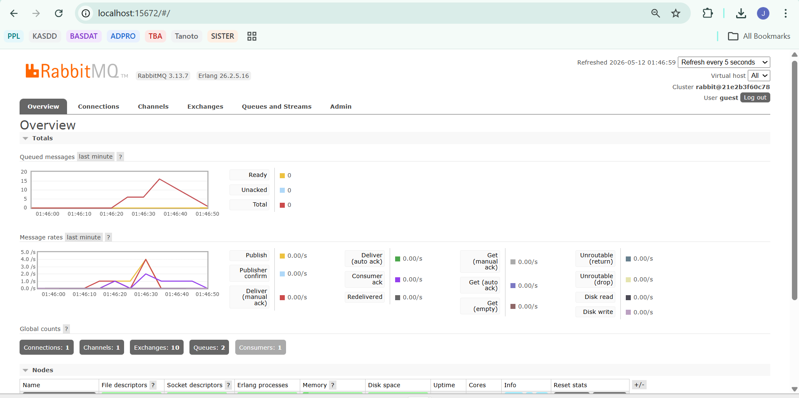
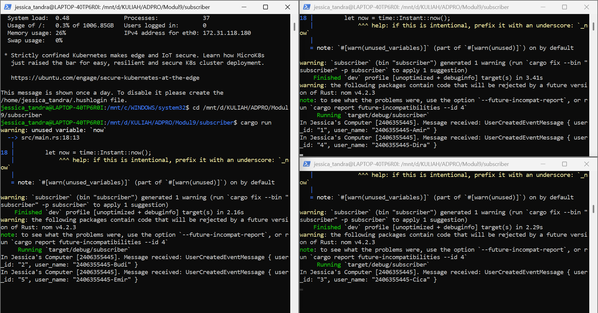
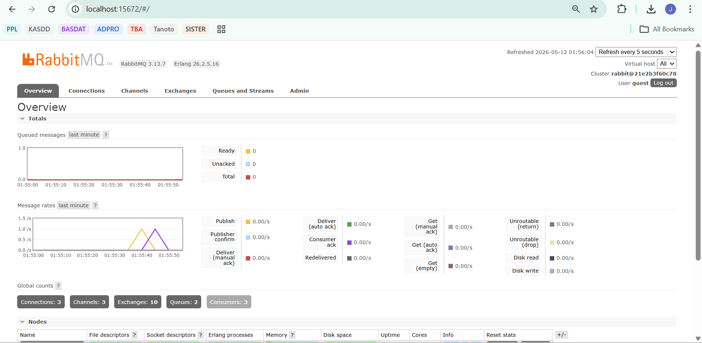

> a. What is amqp?  
 
AMQP (Advanced Message Queuing Protocol) adalah sebuah protokol standar terbuka pada lapisan aplikasi yang dirancang untuk mendukung pengiriman pesan antar komponen sistem secara efisien, aman, dan andal. Protokol ini memungkinkan komunikasi terstandarisasi antara aplikasi client dan message broker seperti RabbitMQ atau Kafka. Dengan menggunakan AMQP, data atau event dapat dikirimkan secara asinkron, sehingga pengirim dan penerima tidak perlu terhubung secara langsung pada waktu yang bersamaan.

> b. What does it mean? guest:guest@localhost:5672 , what is the first guest, and what is the second guest, and what is localhost:5672 is for?  

Format guest:guest@localhost:5672 merupakan sebuah URL atau connection string yang digunakan oleh program untuk melakukan autentikasi dan terhubung ke message broker. Dalam format tersebut, kata guest yang pertama berfungsi sebagai username default, sedangkan kata guest yang kedua berperan sebagai password default untuk mendapatkan hak akses ke dalam sistem RabbitMQ. Selanjutnya, bagian localhost:5672 menunjukkan lokasi server tempat berjalannya message broker tersebut. Secara lebih spesifik, localhost menandakan bahwa RabbitMQ beroperasi secara langsung pada mesin lokal komputer ini, dan ia siap menerima koneksi pertukaran data melalui port 5672.

## Simulation slow subscriber

Berdasarkan grafik tersebut, simulasi slow subscriber telah berhasil dibuktikan dengan munculnya lonjakan signifikan pada grafik "Queued messages". Garis merah menunjukkan bahwa terdapat hingga 15 pesan yang berstatus Unacknowledged secara bersamaan, hal ini terjadi karena publisher dijalankan beberapa kali secara cepat sementara subscriber memproses setiap pesan dengan jeda 1 detik menggunakan thread::sleep.

Pada grafik "Message rates", terlihat bahwa garis oranye (Publish) melonjak tajam saat pesan dikirim, namun garis ungu (Consumer ack) bergerak secara linear dan datar. Perbedaan pola ini menunjukkan adanya backpressure atau penumpukan beban kerja, di mana RabbitMQ bertindak sebagai perantara yang aman untuk menampung lonjakan data agar subscriber yang lebih lambat tidak mengalami overload. Pesan-pesan tersebut tidak hilang, melainkan tersimpan di antrean dan diselesaikan secara bertahap hingga grafik kembali ke angka nol.

## Running at least three subscribers

Ketika menjalankan setidaknya tiga subscriber secara bersamaan, RabbitMQ menerapkan mekanisme Round-Robin untuk mendistribusikan pesan dari publisher ke seluruh konsumen yang tersedia. Dalam gambar, terlihat pesan tersebar ke berbagai terminal, meskipun distribusinya tidak selalu merata secara numerik karena dipengaruhi oleh waktu respons masing-masing instance WSL. Hal ini membuktikan fitur load balancing dari RabbitMQ, di mana satu publisher dapat melayani banyak subscriber sekaligus untuk meningkatkan efisiensi pemrosesan data secara paralel.

Hal ini diperkuat oleh grafik pemantauan RabbitMQ, di mana pada grafik Queued messages, tidak terlihat adanya penumpukan pesan sama sekali (garis tetap berada di angka 0). Hal ini terjadi karena kapasitas pemrosesan dari tiga subscriber yang bekerja secara paralel jauh lebih besar, sehingga setiap pesan yang masuk langsung diambil dan diproses tanpa harus mengantre lama di server. Pada grafik Message rates, lonjakan garis ungu (Consumer ack) menunjukkan bahwa penyelesaian pesan terjadi dengan sangat cepat dan responsif. Efisiensi ini menunjukkan bahwa sistem event-driven ini memiliki skalabilitas yang baik, di mana penambahan jumlah subscriber dapat secara signifikan mengurangi waktu tunggu pesan dalam antrean.

## Improvements

Perbaikan pertama yang krusial adalah memindahkan konfigurasi hardcoded (seperti kredensial dan URL RabbitMQ) ke dalam environment variables agar sistem lebih aman. Kedua, terdapat duplikasi definisi struktur data (seperti UserCreatedEventMessage) di kedua repositori, yang sebaiknya disatukan ke dalam satu shared library (crate) terpisah untuk mencegah inkonsistensi kode. Ketiga, penggunaan .unwrap() yang rentan membuat program crash tiba-tiba harus diganti dengan penanganan error yang lebih baik menggunakan pola Result atau pattern matching. Keempat, simulasi hambatan yang menggunakan thread::sleep (sinkron) sebaiknya diubah menjadi arsitektur asynchronous agar tidak memblokir sumber daya sistem secara keseluruhan. Penerapan perbaikan-perbaikan ini akan membuat arsitektur aplikasi menjadi jauh lebih bersih, tangguh, dan siap untuk digunakan di dunia nyata.